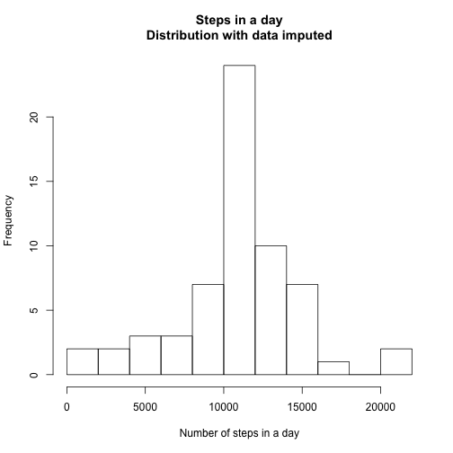
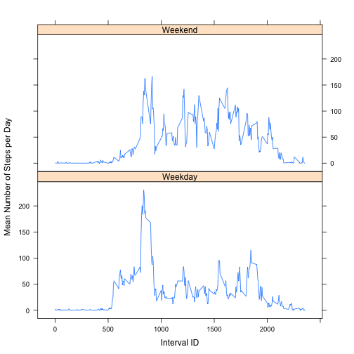

## Loading and preprocessing the data


The data is in the local directory in a file named: `activity.zip`. This is loaded and additional processing only happens as necessary. The analysis will use the library `dplyr`.


```r
setwd("/Users/gamercier/git/RepData_PeerAssessment1")
data <- read.csv(unz("activity.zip","activity.csv"),stringsAsFactors=FALSE)
library(dplyr,quietly=TRUE,warn.conflicts=FALSE)
```


The data consists of a dataframe with three columns labeled `steps`, `date`, and `interval`. This data records the number of steps taken by an individual in a 5 minute interval over the course of each day in a period of 61 days during October and November of 2012. There are 288 intervals each day, and a total of 17568 rows of observations.


```r
head(data)
```

```
##   steps       date interval
## 1    NA 2012-10-01        0
## 2    NA 2012-10-01        5
## 3    NA 2012-10-01       10
## 4    NA 2012-10-01       15
## 5    NA 2012-10-01       20
## 6    NA 2012-10-01       25
```

```r
str(data)
```

```
## 'data.frame':	17568 obs. of  3 variables:
##  $ steps   : int  NA NA NA NA NA NA NA NA NA NA ...
##  $ date    : chr  "2012-10-01" "2012-10-01" "2012-10-01" "2012-10-01" ...
##  $ interval: int  0 5 10 15 20 25 30 35 40 45 ...
```

Each date is encoded in a character string: YYYY-MM-DD. The number of steps is recorded as integer data, unless it is missing when it is recorded as NA.


Each interval is labeled using military time encoded in an integer format. The first 2 digits refer to the hour (0-23) and the last two digits (0-55) to the minutes. However, there no leading zeros and 2400 hours is set to 0, and not 0000. For example, 9 o'clock in the morning is 900 (as opposed to strict military time of 0900), and 9 o'clock at night is 2100. Five minutes after midnight is 5.


For simplicity we retain this labeling scheme for the intervals, and do not convert them into another time format.


## What is the mean total number of steps taken per day?


To answer this question the data is grouped by dates using the `group_by` function in `dplyr`, and then the `summarise` function is applied to add the steps in each group. This allows us to generate a histogram, a plot that shows how often we repeat the same number of steps we take in one day. In other words the frequency distribution for the total number of steps in a day. Here we force execution using the `na.rm=TRUE` option to avoid the complication of missing values.


```r
by_days <- group_by(data,date)
sum_by_days <- summarise(by_days,sum(steps,na.rm=TRUE))

hist(sum_by_days$sum,breaks=10,main="Steps in a day\nDistribution",
     xlab="Number of steps in a day")
```

 

Notice that the distribution is skewed to the left by the missing data.


From this data we can also compute the average number and median number of steps in a day. Then it is easy to see that the average number of steps in a day is close to 10,000. This average is a bit less than the median, consistent with the skewness to the left.


```r
summary(sum_by_days$sum)
```

```
##    Min. 1st Qu.  Median    Mean 3rd Qu.    Max. 
##       0    6778   10400    9354   12810   21190
```


## What is the average daily activity pattern?


To answer this we now group by interval and summarise taking advantage of the `mean` function:


```r
by_interval <- group_by(data,interval)
mean_by_interval <- summarise(by_interval,mean(steps,na.rm=TRUE))

plot(mean_by_interval$interval,mean_by_interval$mean,type="l",
     main="Number Steps in An Interval\nAveraged over Days",
     xlab="Interval ID",ylab="Average Number of Steps")
```

 

This shows us that up to 5 o'clock in the morning there are few steps, but that most of the steps occur near 9 o'clock. The afternoon is more variable, and by 2000, or 8 pm, we are on our way to bed.


## Imputing missing values


There is a number of missing values:


```r
sum(is.na(data$steps))
```

```
## [1] 2304
```

This corresponds to 13.1147541% of the data set.

To impute the data it is wise to work with a copy of the original dataset. Then we fill the missing values using the average steps for that interval, an average computed over all the days, and computed in answering the previous question:


```r
clean_data <- data.frame(data)

for (row in seq(nrow(clean_data))){
    if (is.na(clean_data$steps[row])){
        interval <- clean_data$interval[row]
        pick_mean <- mean_by_interval$interval == interval
        clean_data$steps[row] <- mean_by_interval$mean[pick_mean]
    }
}
```


Then we can review the data again as we did above when we did not impute the missing data:


```r
by_days <- group_by(clean_data,date)
sum_by_days <- summarise(by_days,sum(steps,na.rm=TRUE))

hist(sum_by_days$sum,breaks=10,main="Steps in a day\nDistribution with data imputed",
     xlab="Number of steps in a day")
```

 

This time the skewness is lost, and the median and the average are identical!


```r
summary(sum_by_days$sum)
```

```
##    Min. 1st Qu.  Median    Mean 3rd Qu.    Max. 
##      41    9819   10770   10770   12810   21190
```


## Are there differences in activity patterns between weekdays and weekends?


Splitting the days into weekend and weekday days requires converting the dates from character to a date format using `strptime`. The `weekdays` function gives us the day, and a helper function, `what_day`, converts the day into either "Weekend" or "Weekday". This is stored as a factor with two levels, "Weekend" or "Weekday" in an new column under `clean_data$what.day`. Once this is done it is easy to answer this question using the lattice plotting package using the factors under `what.day`:


```r
what_day <- function(day){
    if(day %in% c("Saturday","Sunday")) return("Weekend")
    return("Weekday")
}
clean_data$what.day <- factor(sapply(weekdays(strptime(clean_data$date,"%Y-%m-%d")),
                                     what_day))

by_interval_what.day <- group_by(clean_data,interval,what.day)
avgs_interval_what.day <- summarise(by_interval_what.day,mean(steps))

library(lattice)

# convert the group_df into a dataframe that the plot function can take
data_as_df <- data.frame(avgs_interval_what.day)
# new names: interval, what.day, mean.steps.
g <- xyplot(mean.steps. ~ interval | what.day, data=data_as_df,
            type="l",layout=c(1,2), xlab = "Interval ID",
            ylab="Mean Number of Steps per Day")
print(g)
```

 


Indeed, there are differences! We see a more even number of steps over weekends than in the weekdays where a large number of steps occur in the morning.


